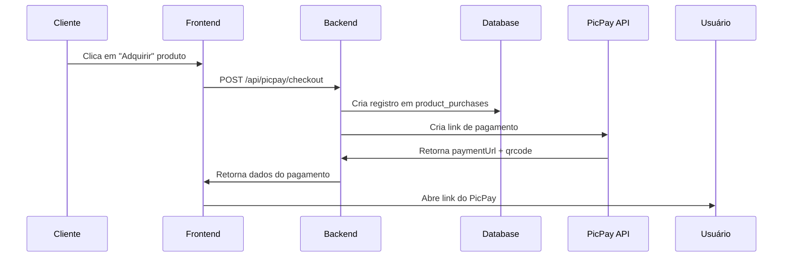
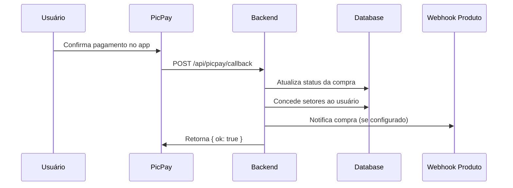

# Sistema de Pagamentos - PicPay

## Visão Geral

Este sistema integra pagamentos via PicPay para venda de produtos digitais. Quando um usuário compra um produto, ele recebe acesso automático aos setores configurados no produto.

## Fluxo de Pagamento

### 1. Criação do Pagamento



### 2. Confirmação do Pagamento



## APIs Disponíveis

### POST /api/picpay/checkout

Cria um novo link de pagamento.

**Request Body:**
```json
{
  "productKey": "farolchat",
  "amount": 99.90,
  "referenceId": "unique-ref-123",
  "returnPath": "/produtos/farolchat/assinar",
  "buyer": {
    "firstName": "João",
    "lastName": "Silva",
    "document": "12345678900",
    "email": "joao@email.com",
    "phone": "+5511999999999"
  },
  "buyerForm": { "nome": "João Silva", "empresa": "Empresa XYZ" },
  "metadata": { "users": 5, "connections": 10 }
}
```

**Response:**
```json
{
  "paymentUrl": "https://app.picpay.com/checkout/...",
  "qrcode": {
    "content": "...",
    "base64": "iVBORw0KGgoAAAANSUhEUgAA..."
  },
  "referenceId": "unique-ref-123"
}
```

### GET /api/picpay/status?ref=REFERENCE_ID

Consulta o status de um pagamento.

**Response:**
```json
{
  "referenceId": "unique-ref-123",
  "status": "paid",
  "authorizationId": "555008cef7f321d00ef236333"
}
```

**Status possíveis:**
- `created`: Pagamento criado, aguardando
- `expired`: Pagamento expirou
- `paid`: Pagamento confirmado
- `completed`: Pagamento completado
- `refunded`: Pagamento estornado
- `chargeback`: Chargeback solicitado

### POST /api/picpay/callback

Webhook chamado automaticamente pelo PicPay quando o status muda.

**Request Body (do PicPay):**
```json
{
  "referenceId": "unique-ref-123",
  "status": "paid"
}
```

## Configuração

### Via Interface Web (/configuracao)

1. Acesse a página de **Configuração**
2. Na seção **Pagamentos**, preencha:
   - **Provider**: `picpay`
   - **PicPay Seller Token**: Token fornecido pelo PicPay
   - **PicPay Client ID**: OAuth2 Client ID (opcional)
   - **PicPay Client Secret**: OAuth2 Client Secret (opcional)
   - **Webhook para consultar créditos**: URL do webhook externo

### Via Variáveis de Ambiente

Crie um arquivo `.env.local` baseado em `.env.local.example`:

```bash
PICPAY_SELLER_TOKEN=seu-token-aqui
PICPAY_CLIENT_ID=seu-client-id-aqui
PICPAY_CLIENT_SECRET=seu-client-secret-aqui
APP_BASE_URL=http://localhost:3000
```

**Nota:** As configurações via interface web têm prioridade sobre as variáveis de ambiente.

## Produtos

### Estrutura de Produto

Cada produto tem:
- **key**: Identificador único (ex: `farolchat`)
- **name**: Nome de exibição
- **description**: Descrição
- **pricing**: Estrutura de preços
  - `basePrice`: Preço base
  - `userPrice`: Preço por usuário (produtos tipo assinatura)
  - `connectionPrice`: Preço por conexão
- **sectors**: Lista de setores que serão concedidos ao comprador
- **webhook_url**: URL chamada quando pagamento é confirmado (opcional)

### Concessão de Acesso

Quando um pagamento é confirmado (`status = 'paid'`):

1. Os **setores** do produto são adicionados ao `user_metadata.sectors` do usuário
2. Se o produto tem `webhook_url`, é enviada uma notificação:
   ```json
   {
     "event": "purchase_paid",
     "referenceId": "unique-ref-123",
     "product": { "key": "farolchat", "name": "FarolChat", ... },
     "purchaseId": 42
   }
   ```

## Páginas de Compra

### Produto Genérico: /produtos/[key]/comprar

Página de compra padrão para produtos com preço fixo.

### FarolChat: /produtos/farolchat/assinar

Página customizada para FarolChat com cálculo dinâmico baseado em:
- Quantidade de usuários
- Quantidade de conexões

## Consulta de Créditos

O botão **Consultar Créditos** no header chama o endpoint `/api/payments/credits`, que por sua vez chama o webhook configurado em **Configurações > Pagamentos > Webhook para consultar créditos**.

**Fluxo:**
1. Usuário clica em "Consultar Créditos"
2. Frontend chama `/api/payments/credits`
3. Backend busca webhook configurado em `global_settings`
4. Backend chama webhook externo passando dados do usuário
5. Retorna resposta para o frontend

## Tabelas do Banco

### product_purchases

Armazena todas as compras realizadas.

```sql
CREATE TABLE product_purchases (
  id BIGSERIAL PRIMARY KEY,
  user_id UUID REFERENCES auth.users(id),
  product_id BIGINT REFERENCES products(id),
  reference_id TEXT UNIQUE NOT NULL,
  amount NUMERIC(10,2) NOT NULL,
  status TEXT NOT NULL DEFAULT 'created',
  buyer JSONB,
  metadata JSONB,
  webhook_status TEXT,
  created_at TIMESTAMPTZ DEFAULT NOW(),
  updated_at TIMESTAMPTZ DEFAULT NOW()
);
```

### products

Produtos disponíveis para venda.

```sql
CREATE TABLE products (
  id BIGSERIAL PRIMARY KEY,
  key TEXT UNIQUE NOT NULL,
  name TEXT NOT NULL,
  description TEXT,
  pricing JSONB,
  sectors TEXT[],
  webhook_url TEXT,
  learn_more_url TEXT,
  created_at TIMESTAMPTZ DEFAULT NOW(),
  updated_at TIMESTAMPTZ DEFAULT NOW()
);
```

## Segurança

- ✅ O `SUPABASE_SERVICE_ROLE_KEY` nunca é exposto ao cliente
- ✅ Tokens de autenticação são validados antes de criar pagamentos
- ✅ ReferenceIds são únicos para evitar duplicatas
- ✅ Callbacks do PicPay são idempotentes (sempre retornam 200 OK)
- ✅ Client Secret do PicPay é do tipo `password` no formulário

## Desenvolvimento Local

1. Configure as variáveis de ambiente no `.env.local`
2. Configure as credenciais via `/configuracao`
3. Use o seller token de sandbox do PicPay para testes
4. Use o ngrok ou similar para receber callbacks localmente:
   ```bash
   ngrok http 3000
   # Use a URL do ngrok como APP_BASE_URL
   ```

## Troubleshooting

### Pagamento não foi confirmado

1. Verifique se o callback foi recebido: `product_purchases.updated_at`
2. Verifique o status no PicPay: `GET /api/picpay/status?ref=REFERENCE_ID`
3. Verifique logs do servidor

### Usuário não recebeu acesso

1. Verifique se os setores estão corretos no produto
2. Verifique `auth.users.user_metadata.sectors` no banco
3. Verifique se `product_purchases.status = 'paid'`

### Webhook não está sendo chamado

1. Verifique se `APP_BASE_URL` está correto
2. Verifique se a URL é acessível publicamente
3. Use ferramentas como webhook.site para debug
